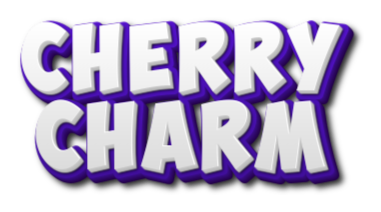
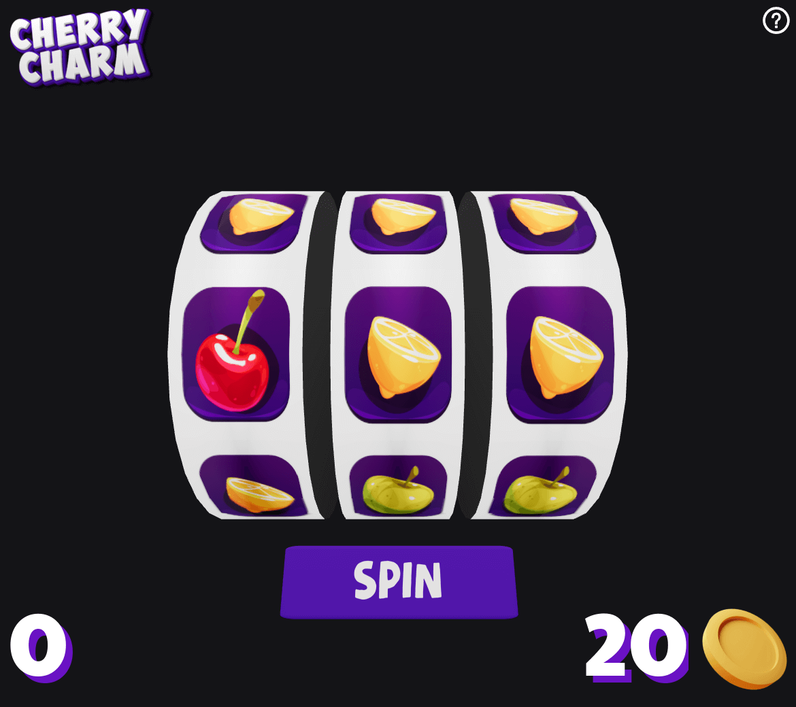
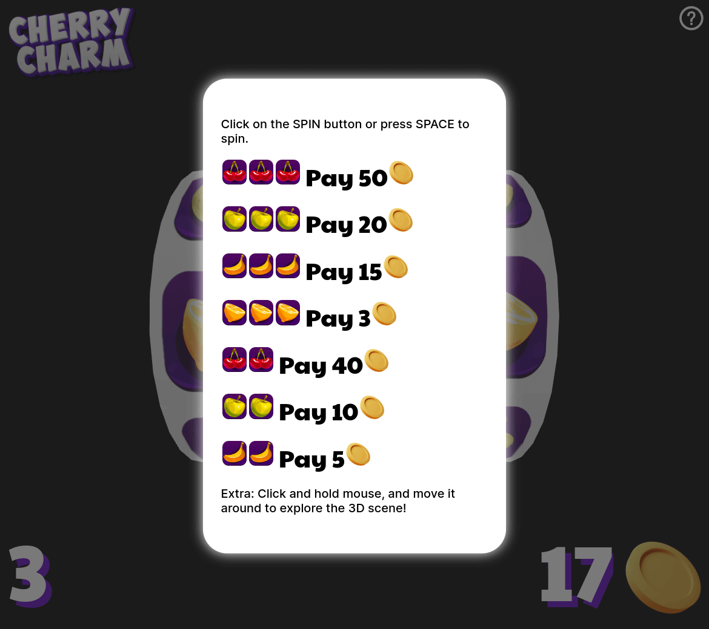
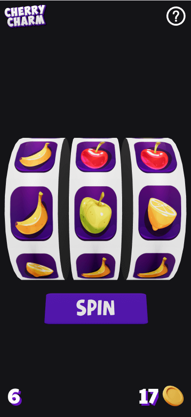
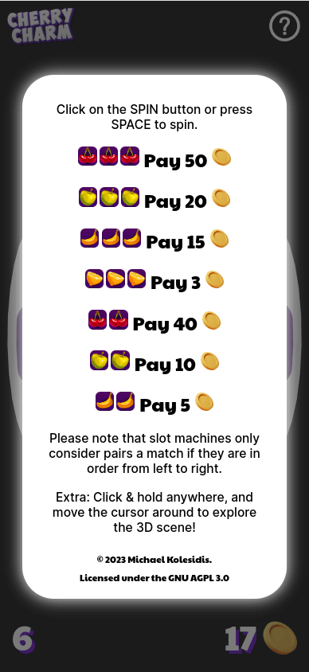

**An online 3D slot machine game.**

<a href='https://ko-fi.com/michaelkolesidis' target='_blank'></a>


This software is free (as in freedom). **If you use any part of this code, you must make your entire project's source code publicly available under the same license.** This applies whether you modify the code or use it as it is in your own project. This ensures that all modifications and derivative works remain free software, so that everyone can benefit. If you are not willing to comply with these terms, you must refrain from using any part of this code.

For full license terms and conditions, you can read the AGPL-3.0 at: [gnu.org/licenses/agpl-3.0.html](https://www.gnu.org/licenses/agpl-3.0.html).

## Information

The game features a slot machine with three reels and four fruits, 🍒🍎🍌🍋. Fruit combinations reward the players with 🪙.

## Features

- Fully responsive for desktop and mobile
- Players can spin the slot machine either by clicking on the _Spin button_ or by pressing _Space_
- Number of coins visible
- Number or spins visible
- _Spin button_ displays _Spinning_ while the reels are spinning, informing players when they can spin again
- Orbit controls: clicking and holding mouse while moving the cursors allows players to change 3D view
- Help button that open the help modal
- Help modal that contains instructions and all winning fruit combinations
- Game logo

### Winning fruit combinations

| Fruits | Rewards |
| :----: | ------: |
| 🍒🍒🍒 |   50 🪙 |
| 🍎🍎🍎 |    20🪙 |
| 🍌🍌🍌 |    15🪙 |
| 🍋🍋🍋 |     3🪙 |
|  🍒🍒  |    40🪙 |
|  🍎🍎  |    10🪙 |
|  🍌🍌  |     5🪙 |

**Please note that slot machines only consider pairs a match if they are in order from left to right.**

## Instructions

In order to run the project locally you need to start

**1.** Install the project dependencies:

```
yarn
```

**2.** Start Vite:

```
yarn dev
```

## Screenshots

### Desktop




### Mobile




## Technologies

The core technologies of _Cherry Charm_ are JavaScript, WebGL and WebAssembly (WASM). The following libraries and tools are used:

| Name              | License | Description                                  |
| ----------------- | :-----: | -------------------------------------------- |
| React             |   MIT   | Component-based, front-end interface library |
| Three.js          |   MIT   | 3D graphics API for the web, based on WebGL  |
| React Three Fiber |   MIT   | A React renderer for Three.js                |
| Drei              |   MIT   | Useful helpers for React Three Fiber         |
| R3F-Perf          |   MIT   | Performance monitoring                       |
| Zustand           |   MIT   | State management                             |
| Vite              |   MIT   | Frontend development tooling                 |
|                   |         |                                              |

## Assets

All the assets used in _Cherry Charm_ (3D models, textures, images, sound effects, music etc.) are either using Creative Commons / Public Domain or they were created by me and can be freely used for commercial purposes. The main factor for choosing and using them was the need to deliver a prototype in a short time. Some (or most) of them should be changed to more appropriate/professional ones for commercial releases of the product.

## Software Used

A non-exhaustive list of all the software that was used during the development of _Cherry Charm_.

- Visual Studio Code
- Blender
- Adobe Illustrator
- Krita
- Inkscape
- Google Chrome
- Microsoft Edge
- Mozilla Firefox
- Figma

## 💖 Support the Project

Thank you so much for your interest in my project! If you want to go a step further and support my open source work, buy me a coffee:

<a href='https://ko-fi.com/michaelkolesidis' target='_blank'></a>

## License

<a href="https://www.gnu.org/licenses/agpl-3.0.html"></a>

Copyright (c) 2023 Michael Kolesidis<br>
Licensed under the [GNU Affero General Public License v3.0](https://www.gnu.org/licenses/agpl-3.0.html).

🍒
